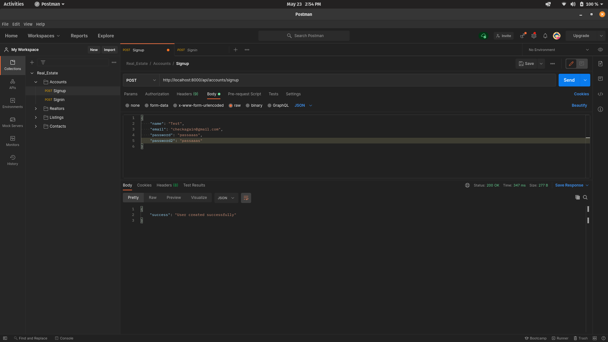
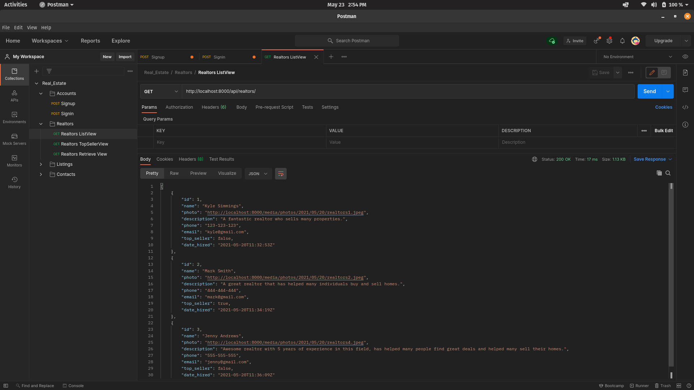
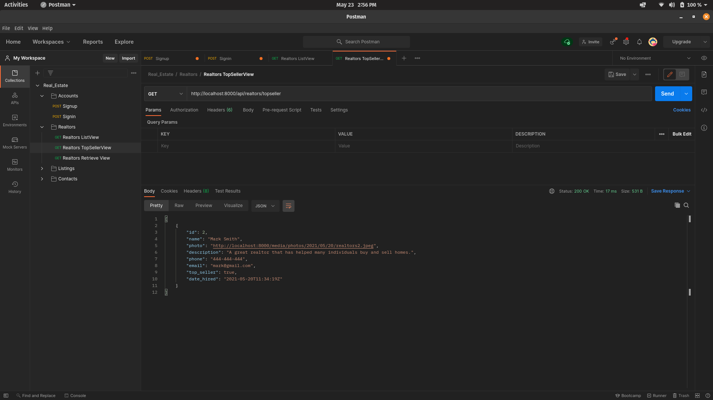
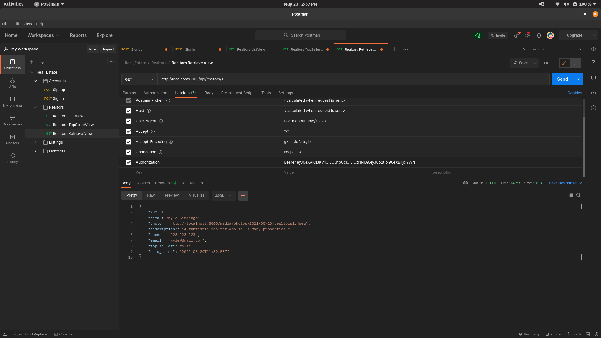
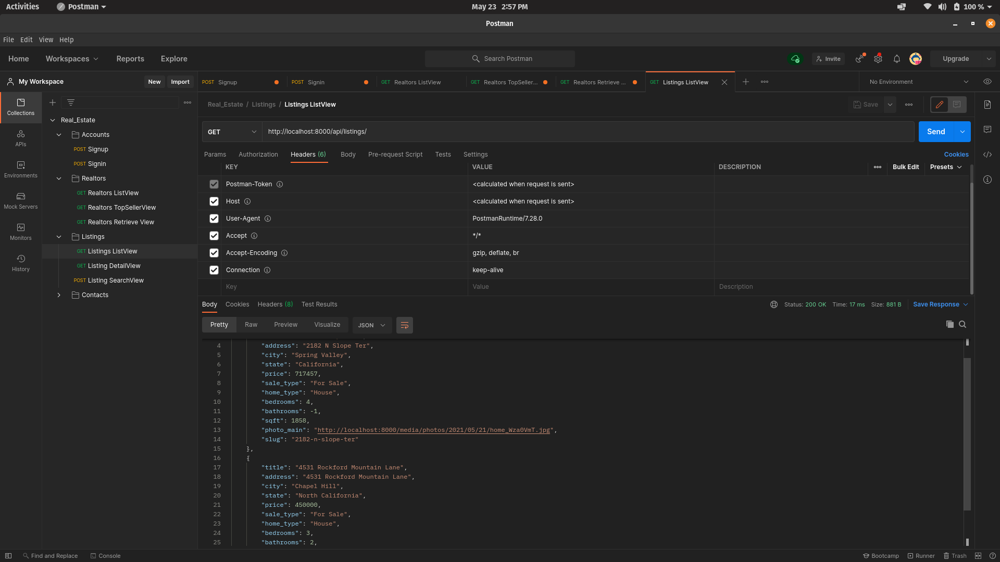
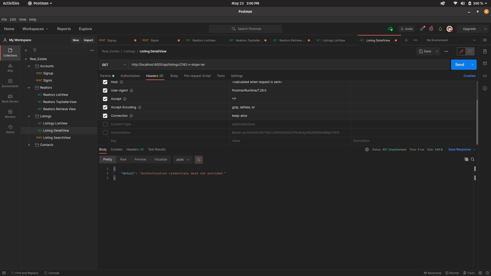

# 🌐 REAL ESTATE WEBSITE

A full stack Real Estate website.

---

## :memo: Progress

- Built backend APIs.
- Tested APIs using Postman.
- Used JSON web token for authentication.
- Integrated PostgreSQL Database.
- Frontend is in development phase.

---

## :bulb: Built Using

- [**REACTJS**](https://reactjs.org/)
- [**REDUX**](https://redux.js.org/)
- [**DJANGO REST FRAMEWORK**](https://www.django-rest-framework.org/)
- [**POSTGRESQL**](https://www.postgresql.org/)
- [**POSTMAN**](https://www.postman.com/)

---

## :computer: Screenshots

These screenshots are of API testing on Postman and will be replaced with final product once project is completed.

### Accounts

### Agents

### Listings

---

## :man: Project Created & Maintained By

  Utkarsh Chaurasia

